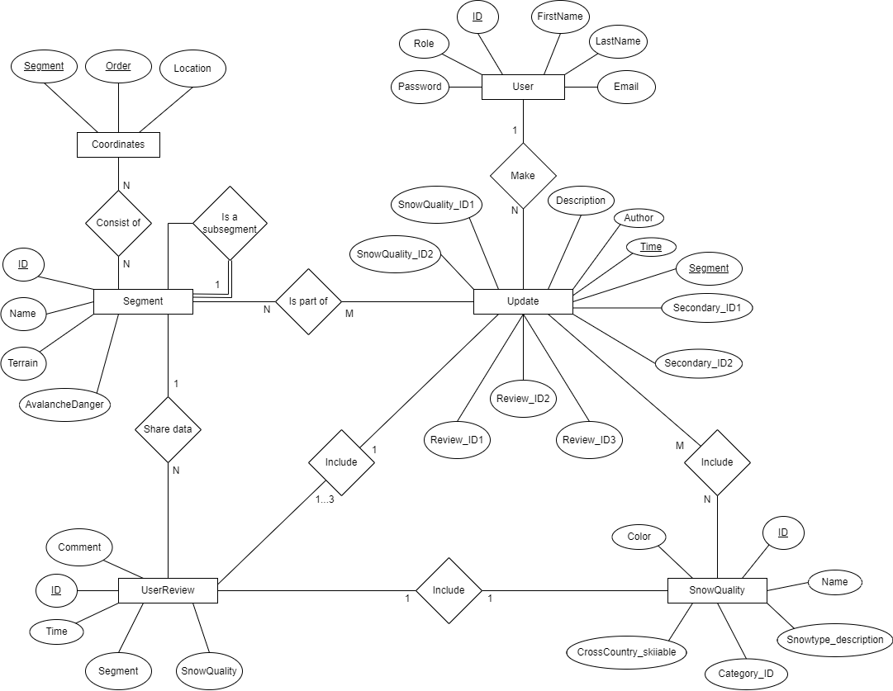
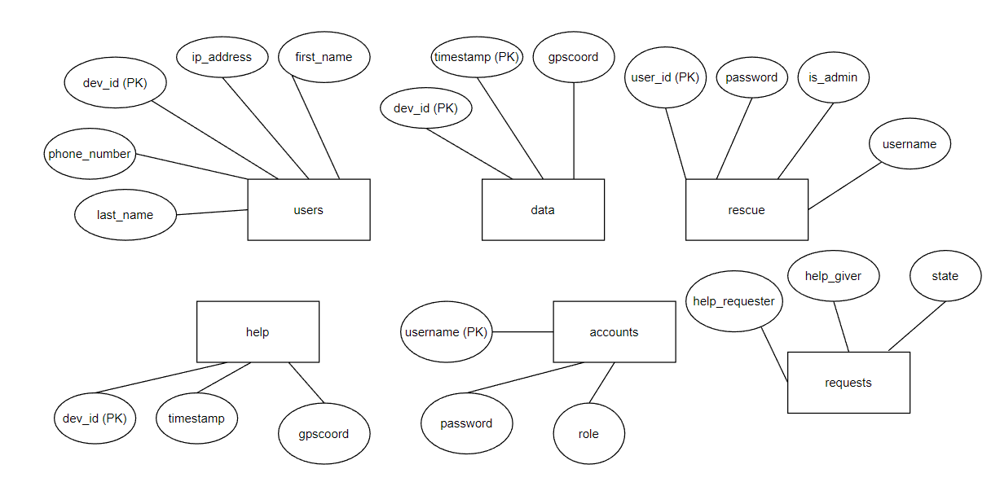

<h1>Documentation on backend</h1>
<font style="color:red" size="5">Note:</font><br/>
<p>Follow the instruction from the readme of the main folder first</p>
<p>when testing with postman, remember to put in the header:</p><br/>

```javascript
{
    Content-Type: application/json
}
```

<h2>Get started testing backend</h2>
<h3>Map-app database</h3>
<ol>
  <li>Populate the MySQL database with folder <code>/src/testSql</code> folder</li>
  <li>Read the <font style="color:red">Back end in code</font> below of the map-app database to understand schema with what route, method to use</li>
  <li>Start server by going into folder <code>/src</code> and run command <code>node app.js</code></li>
  <li>Import the Snowledge.postman_collection.js to your own postman and test the folder <code>map-app database</code></li>
</ol>
<h3>Rescue database</h3>
<ol>
  <li>Read the <font style="color:red">Back end in code</font> below of the Rescue database to understand schema with what route, method to use</li>
  <li>Install python on your machine and test in terminal with command <code>python --version</code></li>
  <li>Go into folder <code>Mobile snowledge/Server/back_end</code> and enter command <code>python test.database.py</code> in terminal to init the tables and put some sample data</li>
  <li>enter command <code>python _app.py</code> to start the application on port 3002</li>
  <li>There will be error because there are packages that the app require, install them with command <code>pip install</code> </li>
  <li>Import the Snowledge.postman_collection.js to your own postman and test the folder <code>rescue database</code></li>
</ol>


<h2>Back end in code</h2>
<h2>The app use 2 database:</h2>
<ol>
    <li>
        <h3>Map-app: This database is use to put have the information on the map (on both phone and web) is written in “src/routers” folder with Node.js, Express and MySQL</h3></br>
         </br>
        .png) </br>
        <h3>API related to database: use http://localhost:3000/api/</h3>
        <ul>
            <li><code>POST /user/login</code> : User login endpoint. Takes in email and password as input. If a user is found with the email and the password matches, a JSON Web Token (JWT) is generated and sent back in the response.</li></br>
            <li><code>GET /segments</code> : Returns all the segments from the database.</li></br>
            <li><code>GET /segments/update/</code> :id: Returns the latest update for a particular segment specified by its ID.</li></br>
            <li><code>GET /segments/update</code> : This route retrieves the latest updates of the segments and their information. The SQL query selects segment information along with three user reviews and their respective information, filtered to show only the most recent updates (3 days or less) for each segment.</li></br>
            <li><code>GET /reviews</code> : This route retrieves the latest user reviews for each segment, filtered to show only the most recent reviews (3 days or less) for each segment.</li></br>
            <li><code>GET /allReviews</code> : This route retrieves all the user reviews along with the snow condition information and the segment information. The SQL query joins three tables: "KayttajaArviot" (user review), "Lumilaadut" (snow quality), and "Segmentit". It filters the results to show only the reviews submitted in the last 1 week.</li></br>
            <li><code>GET /lumilaadut</code> : This route retrieves information about all the snow conditions. The SQL query selects all the rows from the "Lumilaadut" (snow quality) table.</li></br>
            <li><code>POST /review/:id</code> : This endpoint is used to add a review to the "Lumi-informaatio" (snow information) information. It first checks if the req.body.Segmentti matches the req.params.id passed in the URL. If not, it sends a response with a 400 status code and a JSON message "Segmentti numerot eivät täsmää" (Segment numbers do not match). Otherwise, it inserts the review information (timestamp, segment, snow quality, additional information, and comment) into the "KayttajaArviot" (user review) table in the database. Finally, it returns the result of the last inserted ID in the JSON response and sets the status code to 204.</li></br>
            <li><code>POST /updateReview/:id</code> : This endpoint is used to create "an another observation". It updates the Kommentti column in the "KayttajaArviot" (user review) table with the value of req.body.Kommentti where the ID column matches the req.params.id passed in the URL. It returns the result of the update operation in the JSON response and sets the status code to 200.</li></br>
            <li><code>PUT /segment/:id</code> : </br>
Request: </br>

```json
{
  "Nimi": "text",
  "Maatso": "text",
  "Lumivyöryvaara": "Integer",
  "Points": {
    "lat": "integer",
    "lng": "integer"
  }
}
```

The id is in the param already and the Points is optional, if present, then delete existing coordinates (maybe an error because need to update 1 but it delete all existing coordinates?) and create a new coordinate for the segment

</li>
<li><code>DELTE /segment/:id</code> : Delete the segment with corresponding id</li></br>
<li><code>POST /segment</code> : </br>
Request :</br>

```json
{
  "Nimi": "text",
  "Maatso": "text",
  "Lumivyöryvaara": "Boolean",
  "On_Alasegmentti": "integer of another segment",
  "Points": {
    "lat": "integer",
    "lng": "integer"
  }
}
```

Points is optional, if present then insert into the coordinate table.

</li>
            <li><code>POST /update/:id</code> : post an update to table “Paivitykset”.</br>
Request </br>

```json
{
  "decoded": {
    "id": "integer"
  },
  "Segmentti": "text",
  "Kuvaus": "text",
  "Lumilaatu_ID1": "integer",
  "Lumilaatu_ID2": "integer",
  "Toissijainen_ID1": "integer",
  "Toissijainen_ID2": "integer"
}
```

The id is in the API parameter.

</li>
            <li><code>GET /user</code> : get user with the id in the request</br>
Request </br>

```json
{
  "decoded": {
    "id": "integer"
  }
}
```

</li>
            <li><code>POST /user</code> : insert into “Kayttajat” table, hash the given password (min length 7) with bcrypt and save into the database. The role if not exist, then save “operator”. Other not exist return error </br>
Request </br>

```json
{
  "Etunimi": "text",
  "Sukunimi": "text",
  "Sähköposti": "text",
  "Salasana": "text",
  "Rooli": "text"
}
```

</li>
            <li><code>PUT /user/:id</code> : UPDATE table “Kayttajat” table with given request. (role seems to be unchangeable because not present here). The user id is in the API parameter already.</br>
Request </br>

```json
{
  "Etunimi": "text",
  "Sukunimi": "text",
  "Sähköposti": "text",
  "Salasana": "text"
}
```

</li>
            <li><code>DELETE /user/:id</code> : DELETE the user from “Kayttajat” table if the user does not have “admin” role. “admin” user can’t be deleted because of this.</li>
        </ul>
</li>
              <li>
                <h3>Rescue database: written in folder “Mobile snowledge/Server/back_end”, using sqlite3 . The table creation is weird: “data” table have 2 primary keys, “rescue” table “is_admin” entity is an INTEGER, “requests” table doesn’t have primary key and “state” entity is an INTEGER</h3></br>
                       </br>
                <h3>Function related to backend:</h3>
                <ol>
                  <li>
                      <h4><code>_parser.py</code>: (the following functions are used in server.py file directly to user request)</h4>
                      <ul><code>parse_help_request</code>: The function "parse_help_request" is used for processing emergency help requests. It first checks if the requesting device (dev_id) exists in the "users" table of a database and creates an entry of the request if it does. Then, it determines the maximum distance to search for nearby users based on the type of emergency. The function retrieves the closest users within the determined distance and time frame using the "get_closest_users" function. If there is no nearby user, a message is sent to the requesting device indicating so. Otherwise, notifications are sent to the closest users about the emergency request along with the dev_id of the requesting device, its GPS coordinates, the type of emergency, and the distance between them. The same notifications are also sent to all "pallaksenpollot" users.</ul></br>
                      <ul><code>parse_database_entry</code>: This function extracts values from the message and saves the user and data in the database, updating the user's IP address if necessary. If a similar entry already exists in the database, it catches the exception and prints a message.</ul></br>
                      <ul><code>parse_database_help_delete</code>: The function checks if the help request exists, retrieves the requester's information, sends a message to the requester, and deletes the related entries in the database.</ul></br>
                      <ul><code>parse_help_response</code>: This function receives a help response message, a socket connection, and a maximum time value. It updates the state of the help request in the database and sends a message to the requester. If the number of helpers exceeds a specified count, it sends a message to all pending helpers to inform them that their help is no longer needed.</ul></br>
                  </li>
                  <li>
                    <h4><code>_app.py</code>: _rescue_management.py have very similar content with _app.py have more functions (look like _rescue_management.py is a test file or sth unnecessary): The file use to define the API endpoint, so the functionality I’ll leave in the API part, following are the association of API to functions.</h4>
                    <ul>
                      <li><code>rescue_get_user() -> GET /users</code></li>
                      <li><code>register_user() -> POST /register</code></li>
                      <li><code>modify_user() -> PUT /modify</code></li>
                      <li><code>delete_user() -> DELETE /delete</code></li>
                      <li><code>login_user() -> GET /login</code></li>
                      <li><code>get_users() -> GET /get/users</code></li>
                      <li><code>get_help() -> GET /get/help</code></li>
                      <li><code>post_location() -> GET POST /get/location</code></li>
                    </ul>
                  </li>
                </ol>
                <h3>API related to the database use http://localhost:3002/</h3>
                <ul>
                  <li><code>GET /users</code> : get user base on this request </br>
                  Request: </br>
  
  ```json
  {
      "user_id": "5",
      "username": "Sampo",
      "password": "snowledge",
      "is_admin": "0"
  }
  ```
  </li>
                  <li><code>POST /register</code> : create new user in database</br>
                  Request </br>

```json
{
  "username": "Sampo",
  "password": "snow",
  "is_admin": "1"
}
```

  </li>
                  <li><code>PUT /modify</code> : update user information in database</br>
                  Request: </br>

```json
{
  "user_id": "1",
  "username": "Sampo",
  "password": "snow",
  "is_admin": 1
}
```

  </li>
                  <li><code>DELETE /delete/:id</code> : Used to delete user data from the rescue table in the database. The header “Authorization” must be set with format “username:password” </li></br>
                  <li><code>GET /login</code> : to have the user logged into the rescue application. The header “Authorization” must be set with format “username:password”</li></br>
                  <li><code>GET /get/users</code> : get location of all users. The header “Authorization” must be set with format “username:password”</li></br>
                  <li><code>GET /get/help</code> : get the list of all help requesters. The header “Authorization” must be set with format “username:password”</li></br>
                  <li><code>GET or POST /get/location</code> : get last data base on dev_id (does not insert any information so why POST method here?) and num_locations (number of locations user want to get).</br>
                  Request:  </br>

```json
{
  "dev_id": "integer",
  "num_locations": "integer"
}
```

  </li>
                </ul>
              </li>

</ol>
