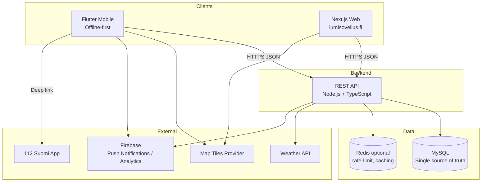

# Lumisovellus "North Star" Rewrite – New Structure (Student Handout)

Purpose: consolidate the current multi-frontend, dual-backend system into a modern, maintainable monorepo with one backend, one database, clear APIs, strong quality gates, and predictable delivery.

## Goals (What “Done” Looks Like)

- Single backend: strict, versioned REST API serving all clients.
- Single database: MySQL (InnoDB), migrations tracked in Github.
- Docker-first: local dev and deploy use containers.
- Flutter app: real native Flutter; offline-first with map and data caching.
- Web: lumisovellus.fi rewritten in Next.js using the same backend.
- Monorepo: TurboRepo orchestrates tasks, caching, and pipelines.
- Quality gates: lint + type-check + tests (unit/integration/e2e), min 80% coverage.
- Clear CI/CD: fast feedback, preview envs optional, trunk-protecting checks.

## Target High-Level Architecture



Notes:

- One backend serves both apps; no WebView in mobile.
- Offline-first uses local storage on device with background sync and conflict handling.
- All external integrations are called server-side when feasible; clients use signed/limited keys when needed (e.g., map tiles).

## Monorepo Layout (TurboRepo)

```
repo/
├─ apps/
│  ├─ backend/          # Node.js + TypeScript REST API (Express)
│  ├─ mobile/           # Flutter app (native, offline-first)
│  └─ web/              # Next.js site (SSR/ISR)
├─ legacy/              # The legacy codebase as a lookup when hunting for a vital parts
├─ packages/
│  ├─ api-client-web/   # GENERATED TS client from OpenAPI (do not edit)
│  ├─ shared/           # Shared utilities (no backend DTOs)
│  ├─ eslint-config/    # Centralized lint rules
│  └─ tsconfig/         # Base TS configs
├─ infra/
│  ├─ docker/           # Dockerfiles, docker-compose.*.yml
│  └─ scripts/          # DB migration, seed, tooling
├─ docs/                # ADRs, architecture notes, runbooks
├─ turbo.json           # Turborepo pipeline
├─ package.json         # Workspace root (for Node workspaces)
└─ .github/workflows/   # CI/CD pipelines
```

Why Turbo:

- Local + remote cache for builds/tests.
- Defines ordered pipelines (e.g., typecheck → test → build).
- Encourages shared tooling and consistent scripts across apps.

## Backend (apps/backend)

- Runtime: Node.js LTS, TypeScript.
- Framework: Express (TypeScript).
- API: REST, versioned under `/api/v1`.
- Validation: Zod on all inputs (body, params, query).
- Auth: Out of scope here. Students must implement a battle-tested standard (e.g., OIDC/OAuth 2.1) using mature libraries; do not roll your own.
- Database: MySQL via Prisma ORM or Knex (Prisma recommended for clarity and DX).
- Migrations: Prisma Migrate.
- Documentation: OpenAPI 3.1 auto-generated from Zod schemas; spec at `/api/openapi.json`; docs at `/api/docs` (Swagger UI/Redoc).
- Error model: consistent JSON `{ error: { code, message, details? } }` with proper HTTP status codes.
- Observability: structured logs (pino/winston), request IDs, basic metrics endpoint.

OpenAPI autogen + clients (REQUIRED):

- Co-locate Zod schemas with route handlers; derive OpenAPI via `zod-to-openapi`.
- Validate requests/responses via Zod middleware or `express-openapi-validator`.
- Both clients must generate their backend client from the Swagger (OpenAPI) spec; do not hand-write DTOs or API calls.
- Generate client SDKs from the OpenAPI spec:
  - TypeScript (web): `openapi-typescript` or `oazapfts` into `packages/api-client-web` (generated).
  - Dart (Flutter): `openapi-generator-cli -g dart-dio` into `apps/mobile/lib/api` (generated).
- Add scripts: `openapi:emit`, `openapi:client:web`, `openapi:client:mobile`; run in CI before typecheck/build and fail if the generated diff is not committed.

Key backend routes (examples):

- `GET /api/v1/segments?updatedSince=...` – delta sync support.
- `POST /api/v1/reports` – create observations.
- `GET /api/v1/weather/:segmentId` – server-side weather proxy.
- `GET /api/v1/map-tiles/:z/:x/:y` – optional tile proxy or signed URL provider.

Non-goals in backend:

- No per-client business logic divergence; the same resources serve web and mobile.
- No direct DB access from clients.

## Database (MySQL)

- Single schema for all domain data (segments, snow types, reviews, rescue/help, locations).
- Enforce foreign keys, indexes for hot queries, soft deletes where needed.
- Audit fields: `createdAt`, `updatedAt`, `updatedBy` (where relevant).
- Seed scripts for dev: minimal data for maps, segments, snow types.
- Migration path from current SQLite → MySQL.

## Mobile (apps/mobile – Flutter)

- Real Flutter app (no WebView). State management: Riverpod/Bloc (choose one, keep it consistent).
- Offline-first pattern:
  - Local DB: `drift` or `hive` for structured data cache and queue of pending writes.
  - Map caching: `flutter_map` with MBTiles/offline tile packs, or cached XYZ tiles.
  - Background sync: retries, exponential backoff, conflict resolution (last-write-wins + server validation for now).
  - Network awareness: graceful degradation with cached content.
- API client GENERATED from the Swagger (OpenAPI) spec using `openapi-generator-cli -g dart-dio`; lives in `apps/mobile/lib/api` (do not edit by hand).
- Testing: unit + widget + integration tests (`integration_test`), golden tests for critical screens.

Core screens:

- Snow map (offline tiles + segment overlays from cache → refresh from API).
- Weather view (cached last known, refresh on connectivity).
- Report flow (queue offline, sync when online).
- Rescue/help (unified resource model in the single backend).

## Web (apps/web – Next.js)

- Next.js (TypeScript), App Router, SSR/ISR as appropriate.
- Data fetching via backend REST API using the GENERATED OpenAPI client; avoid hand-written DTOs and direct client-to-external APIs.
- Generated types and client imported from `packages/api-client-web`.
- Maps: MapLibre or Google Maps component with key management and basic caching.
- Testing: Vitest + Testing Library; Playwright for e2e.

## API Design Standards

- Versioning: prefix `/api/v1`; add `/v2` only when breaking changes are necessary.
- Follow always Open-Closed -principle with api development
- Resource naming: plural nouns (`/segments`, `/reports`).
- Filtering: query params (`?updatedSince=ISO8601&segmentId=...`).
- Pagination: cursor-based or `limit/offset` with `next` cursor in response.
- Idempotency: for create endpoints that may retry (use `Idempotency-Key`).
- Caching: ETag/If-None-Match; 304 responses; Cache-Control where safe.
- Errors: consistent JSON with machine-readable `code` and human `message`.
- Security: Authentication/authorization via a battle‑tested standard (e.g., OIDC/OAuth 2.1) using mature libraries; rate limiting and input validation everywhere.

## Pipelines, Quality Gates, and Coverage

Quality gates (all must pass on PR):

- Format: Prettier (Node/Web) and `dart format` (Flutter). CI runs in check mode and fails on drift; locally, auto-format on save/commit.
- Lint (dev): fast rules while coding (ESLint for Node/Web, `dart analyze` for Flutter).
- Lint (quality gate, CI-only heavy): code complexity limits, circular dependency detection, security and accessibility rule sets.
- Type check: `tsc --noEmit` for Node/Web.
- Tests: unit + integration + e2e; coverage ≥ 80% per app.

Recommended tools:

- Format: Prettier, `dart format`.
- Backend: Vitest + Supertest, Prisma test DB.
- Web: Vitest + Testing Library, Playwright for e2e.
- Mobile: `flutter test`, `integration_test`, golden tests; Patrol/Flutter Driver optional.
- Heavy lint (CI):
  - Circular deps: Madge or dependency-cruiser.
  - Complexity: eslint-plugin-complexity / sonarjs.
  - Security: eslint-plugin-security, dependency audit, secret scan (e.g., gitleaks).
  - Accessibility (web): eslint-plugin-jsx-a11y.

Example Turbo pipeline (conceptual):

```json
{
  "pipeline": {
    "format": { "outputs": [] },
    "lint": { "outputs": [] },
    "lint:deep": { "dependsOn": ["^lint"], "outputs": [] },
    "typecheck": { "dependsOn": ["^typecheck"], "outputs": [] },
    "test": { "dependsOn": ["typecheck"], "outputs": ["coverage/**"] },
    "build": {
      "dependsOn": ["format", "lint", "lint:deep", "test"],
      "outputs": ["dist/**", ".next/**"]
    }
  }
}
```

Notes:

- Keep dev-time feedback fast (format, basic lint, unit tests). Run deep lint (complexity, circular refs, security, a11y) in CI quality gates where longer runtimes are acceptable.

## CI/CD (example: GitHub Actions)

- Workflows per app, plus root checks. Required checks: lint, typecheck, test (≥80%), build.
- Matrix for Node versions (LTS), platforms for Flutter as needed.
- Caching: Turbo remote cache + actions/cache for npm/pub.
- Artifacts: backend Docker image, web static output, mobile build artifacts (optional).
- Optional: preview deployments (Vercel/Netlify) for web.

Environments:

- `develop` → ephemeral preview per PR (web), no auto-deploy.
- `staging` → auto-deploy to staging environment after checks pass.
- `main` → auto-deploy to production on signed/tagged releases.

## Branching & Releases (Git Flow)

- Branches:
  - `main`: production history (only release/hotfix merges land here).
  - `develop`: integration branch for next release.
  - `staging`: long-lived pre-production branch; deploys to staging on merge.
  - `feature/<short-name>`: feature work branched from `develop`, squash-merged back.
  - `release/x.y.z`: stabilize for release (from `develop`), only fixes/docs; then merge to `main` and back to `develop`.
  - `hotfix/x.y.z`: urgent fixes from `main`; merge to `main` and back to `develop`.
- PR rules:
  - Features → `develop` (require review + green checks).
  - Releases → `staging` first for validation; then to `main` (tag). Always merge back to `develop`.
  - Hotfixes → `main` (tag), and also merge back to `staging` and `develop`.
- Versioning & tags: SemVer. Tag releases on `main` as `vX.Y.Z`.
- Commit style: Conventional Commits recommended to enable changelog automation.
- Branch protection: require 1+ review, lint/typecheck/tests, and 80% coverage before merge.
- CI mapping:
  - On PR to `develop`: lint, typecheck, test, build; optional preview (web).
  - On merge to `staging`: deploy to staging after required checks; run smoke/e2e tests against staging.
  - On `release/*` branches: produce RC artifacts and target `staging` deployments.
  - On tag `v*` on `main`: build & publish Docker image(s), deploy to production, create GitHub Release.

## Docker and Local Dev

- `infra/docker/docker-compose.dev.yml` runs MySQL and backend; web can run `next dev`; mobile runs via `flutter run`.
- Multi-stage Dockerfiles: small runtime images for backend and web.
- `.env` files per app; never commit secrets. Consider SOPS/1Password for secret management.
- Makefile or npm scripts for common tasks: `dev`, `db:migrate`, `db:seed`, `test`, `lint`.

## Security Baseline

- Secrets in env/secret manager (for pipeline at the Github); never in repo. All secrets and credentials must be handed out for Pallaksen Pöllöt.
- HTTPS everywhere in production; HSTS and sane security headers.
- Input validation + output encoding; centralized error handling.
- Rate limiting + basic WAF; authentication on mutating endpoints.
- Dependency updates and vulnerability scans in CI (`npm audit`, `pip-audit` not needed here, Dependabot/Renovate).

## Observability

- Structured logs with request IDs; log levels by env.
- Basic metrics: request rate, latency, error rate; health/readiness endpoints.
- Centralized log sink (e.g., CloudWatch/ELK) if infra allows.

## Definition of Done (per PR)

- Updated OpenAPI and shared types if API changed.
- Lint and typecheck pass; tests updated; coverage maintained ≥ 80%.
- Docs updated (README for the app, ADR if architectural decision).
- Security checks pass (no high vulns); CI green.

---

Keep this handout concise and actionable. Use it as the target “north star” while implementing in phases. Refer to `lumisovellus.md` for current-state details you are consolidating away from.
